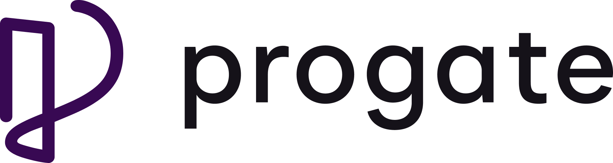
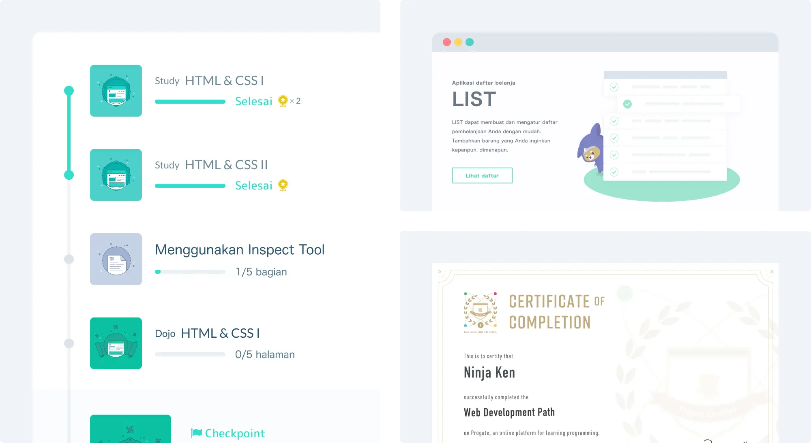

 

  

 

  <a href="https://progate.com/">Progate</a> adalah platform pembelajaran pemrograman secara online dalam bahasa Indonesia dan Inggris. Dengan Progate kamu dapat belajar programming secara mandiri dan terstruktur.

  Progate menawarkan platform yang sangat intuitif untuk belajar coding. Antarmuka dari platform yang sangat interaktif dan juga materi yang disusun secara terstruktur, membuat pengalaman belajar menjadi makin asyik dan mudah untuk dimengerti.

  Selain itu, biaya berlangganan yang sangat terjangkau merupakan sebuah nilai tambah. Belajar coding tidak hanya berguna untuk mereka yang mengejar karir sebagai software developer, tetapi juga membantu orang untuk mengasah kreativitas, pemikiran logis, dan kemampuan untuk memecahkan masalah secara mandiri.

 
